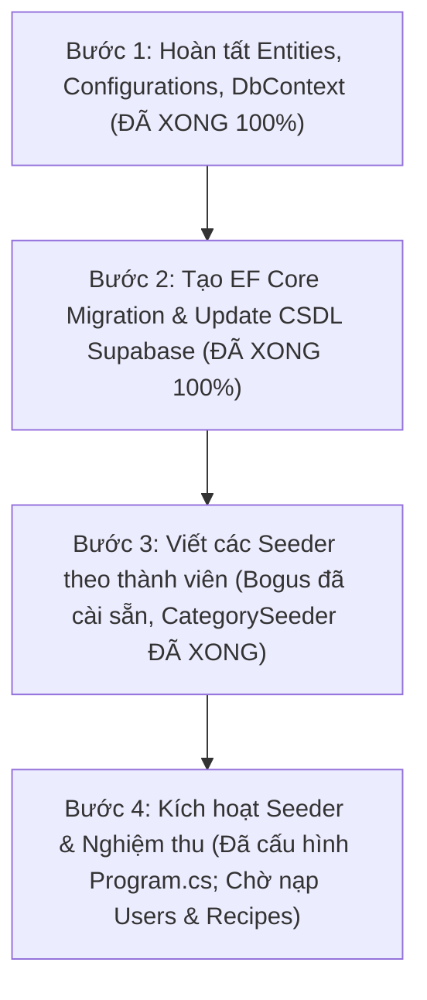

# KẾ HOẠCH CHI TIẾT TRIỂN KHAI & HOÀN TẤT YÊU CẦU NỘP BÀI LAB 2
## DỰ ÁN: CULINARY BLOG (.NET 10 MINIMAL APIS + SUPABASE CLOUD)
> **Môn học:** Phát triển Ứng dụng Web Nâng cao (PTUDWNC) – Nhóm 4
> **Căn cứ yêu cầu:**
> 1. Đề bài: **Yêu cầu tối thiểu của Lab 2** (Đặc tả 5 tiêu chí chấm điểm bắt buộc).
> 2. Bảng phân công chi tiết: `docs/tasks_breakdown.md` (WBS v2.1) & `README.md`.
> **Vị trí tài liệu:** `docs/KE_HOACH_LAB2.md`

---

## 1. MA TRẬN ĐỐI CHIẾU 5 TIÊU CHÍ LAB 2 & PHÂN CÔNG THÀNH VIÊN

| STT | Tiêu chí Yêu cầu Tối thiểu của Lab 2 | Thành viên Phụ trách | Vị trí trong `tasks_breakdown.md` | Trạng thái Hiện tại |
| :---: | :--- | :--- | :--- | :--- |
| **1** | **Hoàn thành tạo cấu trúc dự án backend theo Clean Architecture** | 👤 **Thành viên 1 (Trưởng nhóm)**: Nguyễn Thị Trà My | **Mục 1 (Kiến trúc) & TV1 - Bước 1** (Dòng 11 - 70) | 🟢 **100% HOÀN TẤT** (Solution `CulinaryBlog.slnx` 4 tầng) |
| **2** | **Hoàn thành cài đặt các gói thư viện cần thiết** | 👤 **Thành viên 1 (Trưởng nhóm)**: Nguyễn Thị Trà My | **TV1 - Bước 1 (Hạ tầng NuGet)** (Dòng 43, 68) | 🟢 **100% HOÀN TẤT** (EF Core, Npgsql, Identity, MediatR,...) |
| **3** | **Cài đặt các lớp Entities, Configuration, DbContext** | 👤 **TV1 (My)**, **TV2 (Linh)**, **TV3 (Vương)** | **TV1**: Bước 1 (Hạ tầng); **TV2**: Bước 1 (Auth); **TV3**: Bước 1 (Recipe) | 🟢 **100% HOÀN TẤT** (8 Entities + 2 Configs + DbContext) |
| **4** | **Tạo Migration, cài đặt các lớp tạo dữ liệu ngẫu nhiên** | 👤 **TV1 (My)**: Điều phối & `CategorySeeder`; **TV2 (Linh)**: `UserSeeder`; **TV3 (Vương)**: `RecipeSeeder` | **TV1**: Bước 1; **TV2**: Bước 1; **TV3**: Bước 1 | 🟡 **Đang tiến hành** (Migration & CategorySeeder ĐÃ XONG; Bogus đã cài sẵn; Đang chờ UserSeeder & RecipeSeeder) |
| **5** | **CSDL chứa $\ge$ 20 categories, $\ge$ 100 recipes (mỗi recipe $\ge$ 10 nguyên liệu, $\ge$ 5 bước)** | 👤 **TV1 (My)**: $\ge 20$ Categories; **TV2 (Linh)**: Users; **TV3 (Vương)**: $\ge 100$ Recipes; **TV4 (Đoan)**: FTS & Phân trang | **TV1**: Bước 1; **TV2**: Bước 1; **TV3**: Bước 1; **TV4**: Bước 1 | 🟡 **Đang tiến hành** (Bảng `Categories` đã có 25 dòng; Đang chờ nạp Users và Recipes) |

---

## 2. PHÂN TÍCH VAI TRÒ & VỊ TRÍ CÔNG VIỆC CỦA TỪNG THÀNH VIÊN TRONG LAB 2

### 👤 THÀNH VIÊN 1 (TRƯỞNG NHÓM): NGUYỄN THỊ TRÀ MY — MSSV: 2312693
* **Vai trò trong Lab 2:** **Tổng công trình sư Kiến trúc, Quản trị CSDL & Category Seeder**
* **Vị trí trong `tasks_breakdown.md`:** **Mục 1 (Kiến trúc)**, **Mục 2 (Ma trận CSDL)** và **Mục 3: TV1 - Bước 1**.
* **Nhiệm vụ cụ thể trong Lab 2:**
  1. *[Đã hoàn thành]* Tạo Solution `CulinaryBlog.slnx`, thiết lập Project References 4 tầng Clean Architecture.
  2. *[Đã hoàn thành]* Tạo các lớp cơ sở `BaseEntity.cs` và tiện ích SEO `SlugHelper.cs` (Domain).
  3. *[Đã hoàn thành]* Tạo lớp `ApplicationDbContext.cs` kế thừa `IdentityDbContext<ApplicationUser>`, khai báo các `DbSet` và kích hoạt extension `unaccent`, `pg_trgm`.
  4. *[Đã hoàn thành]* Tạo cấu hình Fluent API `CategoryConfiguration.cs`.
  5. *[Đã hoàn thành]* Viết `CategorySeeder.cs` sinh $\ge 20$ danh mục ẩm thực thực tế (25 danh mục chuẩn SEO).
  6. *[Đã hoàn thành]* Đại diện nhóm chạy lệnh EF Core Migration (`InitialCreate`) và tích hợp lệnh gọi Seeder tập trung trong `Program.cs`.

---

### 👤 THÀNH VIÊN 2: HOÀNG TRỊNH VIỆT LINH — MSSV: 2312664
* **Vai trò trong Lab 2:** **Thực thể Người dùng (Identity User), Bảo mật Token & User Seeder**
* **Vị trí trong `tasks_breakdown.md`:** **Mục 2 (Ma trận CSDL)** và **Mục 3: TV2 - Bước 1**.
* **Nhiệm vụ cụ thể trong Lab 2:**
  1. *[Đã hoàn thành & Đã merge]* Xây dựng thực thể `ApplicationUser.cs` mở rộng từ `IdentityUser` bổ sung `DisplayName`, `AvatarUrl`, `Bio`, `CreatedAt`, `IsActive`.
  2. *[Đã hoàn thành & Đã merge]* Xây dựng thực thể `RefreshToken.cs` (chuẩn hóa bảo mật `TokenHash`, `ReplacedByTokenHash`, `RevokedAt`).
  3. *[Đã hoàn thành & Đã merge]* Xây dựng `JwtSettings.cs`, `IJwtService.cs` và hiện thực `JwtService.cs` (thuật toán HS256, CSPRNG, chống `alg:none` attack).
  4. **[Cần làm ngay]:** Viết `UserSeeder.cs` khởi tạo sẵn tài khoản Admin (`admin@culinary.local`) và Author mẫu (`chef_admin@culinary.local`) để cung cấp `AuthorId` cho TV3 liên kết công thức.

---

### 👤 THÀNH VIÊN 3: PHAN KHÁNH VƯƠNG — MSSV: 2312802
* **Vai trò trong Lab 2:** **Thực thể Nghiệp vụ Công thức (Recipe Aggregate Root), Fluent API & Recipe Seeder**
* **Vị trí trong `tasks_breakdown.md`:** **Mục 2 (Ma trận CSDL)** và **Mục 3: TV3 - Bước 1**.
* **Nhiệm vụ cụ thể trong Lab 2:**
  1. *[Đã hoàn thành & Đã merge]* Xây dựng Aggregate Root `Recipe.cs` đầy đủ các thuộc tính chuẩn hóa và quan hệ 1-N.
  2. *[Đã hoàn thành & Đã merge]* Xây dựng các thực thể con: `RecipeStep.cs`, `RecipeIngredient.cs`, `RecipeImage.cs` và Value Object `RecipeNutrition.cs`.
  3. *[Đã hoàn thành & Đã merge]* Xây dựng các Enums: `RecipeDifficulty.cs` và `RecipeStatus.cs`.
  4. *[Đã hoàn thành & Đã merge]* Xây dựng `RecipeConfiguration.cs` (cấu hình Cascade Delete, Nullable CategoryId, Concurrency Token RowVersion).
  5. **[Cần làm ngay]:** Viết `RecipeSeeder.cs` sử dụng thư viện `Bogus` sinh ngẫu nhiên $\ge 100$ Recipes chi tiết (mỗi Recipe tự động sinh từ 10–14 `RecipeIngredient` và 5–8 `RecipeStep`, gắn `AuthorId` của TV2 và `CategoryId` của TV1).

---

### 👤 THÀNH VIÊN 4: LÊ PHẠM MI ĐOAN — MSSV: 2312597
* **Vai trò trong Lab 2:** **Hạ tầng CSDL FTS Tiếng Việt & Kiểm định Toàn vẹn Dữ liệu Mẫu**
* **Vị trí trong `tasks_breakdown.md`:** **Mục 2 (Ma trận CSDL)** và **Mục 3: TV4 - Bước 1**.
* **Nhiệm vụ cụ thể trong Lab 2:**
  1. *[Phối hợp Hạ tầng]* Cùng TV1 đảm bảo `ApplicationDbContext` kích hoạt sẵn extension `unaccent` và `pg_trgm`, cấu hình Generated Column `SearchVector` và chỉ mục **GIN Index** trong `RecipeConfiguration.cs`.
  2. **[Cần làm ngay]:** Kiểm định chất lượng tập dữ liệu $\ge$ 100 công thức và $\ge$ 20 danh mục do các Seeder nạp vào; kiểm tra tính toàn vẹn dữ liệu mẫu phục vụ phân trang an toàn (`PaginatedResult<T>`) và tìm kiếm FTS không dấu.

---

## 3. LỘ TRÌNH 4 BƯỚC HÀNH ĐỘNG ĐỂ HOÀN TẤT 100% LAB 2

### 🔹 BƯỚC 1: Hoàn tất DbContext & Configurations (ĐÃ HOÀN THÀNH)
- [x] Tạo `CulinaryBlog.Infrastructure/Persistence/ApplicationDbContext.cs`.
- [x] Tạo `CulinaryBlog.Infrastructure/Persistence/Configurations/CategoryConfiguration.cs`.
- [x] Tích hợp `FrameworkReference Microsoft.AspNetCore.App` vào `CulinaryBlog.Infrastructure.csproj`.
- [x] Đăng ký `AddInfrastructure()` trong `Program.cs`.

---

### 🔹 BƯỚC 2: Tạo Migration và Đẩy cấu trúc bảng lên Supabase Cloud (ĐÃ HOÀN THÀNH)
* **Người thực hiện:** Trưởng nhóm (Nguyễn Thị Trà My).
* **Kết quả thực hiện:**
  - [x] Tạo file migration `InitialCreate` ghi nhận toàn bộ 13 bảng.
  - [x] Cập nhật và tạo bảng trực tiếp trên Supabase PostgreSQL Cloud qua `dotnet ef database update`.
* **Kết quả nghiệm thu:** Đã kiểm tra trực tiếp trên Supabase Dashboard mục **Table Editor**, xuất hiện đầy đủ các bảng: `AspNetUsers`, `Categories`, `Recipes`, `RecipeSteps`, `RecipeIngredients`, `RecipeImages`, `RefreshTokens`,...

---

### 🔹 BƯỚC 3: Viết các Seeder theo từng thành viên (Đã có sẵn thư viện `Bogus`)
* **Thư viện sinh dữ liệu ngẫu nhiên:** Gói `Bogus` (v35.6.5) đã được Trưởng nhóm (TV1) cài đặt sẵn vào `CulinaryBlog.Infrastructure.csproj`. TV3 không cần cài thêm, chỉ việc khai báo `using Bogus;` để viết code.
* **Người thực hiện:** Cả 3 thành viên phối hợp (TV1 điều phối):
  1. **TV2 (Linh):** [Cần làm ngay] Viết `UserSeeder.cs` tạo tài khoản Admin (`admin@culinary.local`) và Author mẫu (`chef_admin@culinary.local`) làm tác giả công thức.
  2. **TV1 (My):** [Đã hoàn thành] Viết `CategorySeeder.cs` sinh danh sách 25 danh mục ẩm thực thực tế (đã nạp thành công 25 dòng lên Supabase).
  3. **TV3 (Vương):** [Cần làm ngay] Viết `RecipeSeeder.cs` (sử dụng thư viện `Bogus` đã có sẵn) sinh $\ge 100$ công thức chi tiết:
     - Gán `CategoryId` lấy từ `CategorySeeder` (dải ID `11111111-1111-1111-1111-111111111101` đến `...1125`) và `AuthorId` lấy từ `UserSeeder`.
     - Mỗi Recipe sinh từ **10 đến 14 RecipeIngredients** (thỏa mãn $\ge 10$).
     - Mỗi Recipe sinh từ **5 đến 8 RecipeSteps** (thỏa mãn $\ge 5$, tự động đánh số `StepNumber = 1, 2, 3...`).
     - Nhúng đầy đủ giá trị dinh dưỡng `RecipeNutrition`.
  4. **TV1 (My):** [Đã hoàn thành] Tạo lớp điều phối `CulinaryBlogSeeder.cs` gọi tuần tự: `UserSeeder` $\rightarrow$ `CategorySeeder` $\rightarrow$ `RecipeSeeder`.

---

### 🔹 BƯỚC 4: Kích hoạt Seeder trong `Program.cs` & Nghiệm thu (TV1 & TV4)
* **Người thực hiện:**
  - **TV1 (Trưởng nhóm):** [Đã hoàn thành] Tích hợp gọi `await CulinaryBlogSeeder.SeedAsync(app.Services);` trong `Program.cs`.
  - **TV4 (Đoan):** [Cần làm sau khi nạp đủ data] Kiểm định chất lượng dữ liệu FTS và phân trang trên Supabase.
* **Kiểm tra nghiệm thu (Definition of Done Lab 2):**
  1. Chạy `dotnet run --project CulinaryBlog.API`.
  2. Mở trình duyệt vào Supabase Dashboard:
     * Bảng `AspNetUsers`: Có tài khoản Admin & Author mẫu.
     * Bảng `Categories`: Đạt **25 dòng** (yêu cầu $\ge 20$).
     * Bảng `Recipes`: Đạt **100 dòng** (yêu cầu $\ge 100$).
     * Bảng `RecipeIngredients`: Đạt $\ge$ **1.000 dòng** (mỗi bài $\ge 10$ nguyên liệu).
     * Bảng `RecipeSteps`: Đạt $\ge$ **500 dòng** (mỗi bài $\ge 5$ bước).

---

## 4. BẢNG CHECKLIST NGHIỆM THU LAB 2 (DEFINITION OF DONE)

- [x] **Tiêu chí 1:** Cấu trúc dự án Backend phân tách 4 tầng Clean Architecture rõ ràng, build thành công (`CulinaryBlog.slnx`).
- [x] **Tiêu chí 2:** Cài đặt đầy đủ các gói NuGet theo chuẩn Giáo trình Chương 1 & Chương 2.
- [x] **Tiêu chí 3:** Các Entities kế thừa `BaseEntity`/`IdentityUser`, Fluent API Configurations và `ApplicationDbContext` hoàn chỉnh.
- [x] **Tiêu chí 4:** Migration `InitialCreate` được sinh ra và áp dụng thành công lên Supabase PostgreSQL.
- [ ] **Tiêu chí 5:** CSDL Supabase chứa tối thiểu 20 Categories, 100 Recipes (mỗi bài có ít nhất 10 nguyên liệu và ít nhất 5 bước chế biến).
