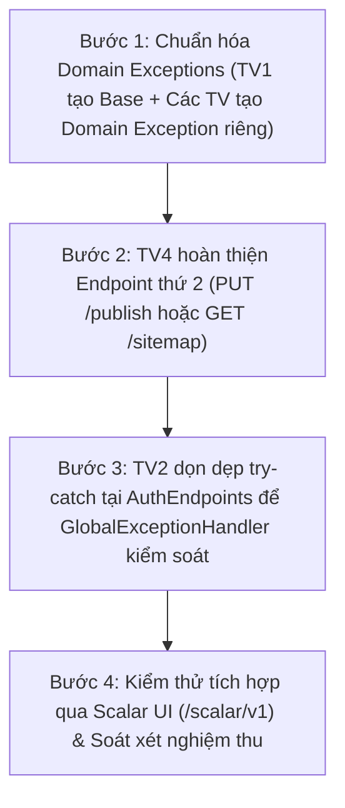

# KẾ HOẠCH CHI TIẾT TRIỂN KHAI & HOÀN TẤT YÊU CẦU NỘP BÀI LAB 3
## DỰ ÁN: CULINARY BLOG (.NET 10 MINIMAL APIS + SUPABASE CLOUD)
> **Môn học:** Phát triển Ứng dụng Web Nâng cao (PTUDWNC) – Nhóm 4  
> **Căn cứ yêu cầu:**  
> 1. Đề bài: **Yêu cầu tối thiểu của Lab 3** (Đặc tả 4 tiêu chí đánh giá bắt buộc).  
> 2. Bảng phân công chi tiết: `docs/tasks_breakdown.md` (WBS v2.1) & `README.md`.  
> **Vị trí tài liệu:** `docs/KE_HOACH_LAB3.md`  

---

## 1. MA TRẬN ĐỐI CHIẾU 4 TIÊU CHÍ LAB 3 & PHÂN CÔNG THÀNH VIÊN

| STT | Tiêu chí Yêu cầu Tối thiểu Lab 3 | Thành viên Phụ trách | Hiện trạng Dự án | Đánh giá & Khoảng trống |
| :---: | :--- | :--- | :--- | :--- |
| **1** | **Hoàn thành việc cài đặt các lớp domain exceptions** | 👤 **Cả 4 thành viên** (TV1 chủ trì tạo lớp base) | ⚠️ **Chưa đạt** | Chưa có thư mục `src/CulinaryBlog.Domain/Exceptions/`. Toàn bộ Exception đang nằm ở tầng Application (`ApplicationExceptions.cs`). |
| **2** | **Hoàn thành việc cài đặt các lớp repository & unit of work** | 👤 **TV1** (Category), **TV3** (Recipe & UoW), **TV4** (FTS Search) | 🟢 **ĐÃ HOÀN TẤT** | Đã có `IUnitOfWork` & `UnitOfWork` (xử lý Concurrency & PostgresException), `CategoryRepository`, `RecipeRepository` (tích hợp FTS). |
| **3** | **Hoàn thành việc cài đặt ít nhất 2 API endpoints / thành viên** | 👤 **Cả 4 thành viên** (mỗi TV $\ge$ 2 routes) | 🟡 **3/4 Thành viên đạt** | • TV1: 2 endpoints (Đạt)<br>• TV2: 2 endpoints (Đạt)<br>• TV3: 2 endpoints (Đạt)<br>• **TV4: 1 endpoint (Chưa đạt - Thiếu 1 endpoint)** |
| **4** | **Hoàn thành việc tạo middleware để bắt lỗi và trả về problem details ở mức toàn cục** | 👤 **TV1** (Trưởng nhóm - Observability) | 🟢 **ĐÃ HOÀN TẤT** | Đã có `GlobalExceptionHandler` (chuẩn `IExceptionHandler` & RFC 7807 ProblemDetails). Cần TV2 dọn bớt khối `try-catch` inline tại `AuthEndpoints.cs`. |

---

## 2. PHÂN TÍCH HIỆN TRẠNG & CÔNG VIỆC CẦN LÀM THÊM CỦA TỪNG THÀNH VIÊN

### 👤 THÀNH VIÊN 1 (TRƯỞNG NHÓM): NGUYỄN THỊ TRÀ MY — MSSV: 2312693
* **Module đảm nhiệm:** Module Quản lý Danh mục (FR-CAT) & Giám sát Hệ thống (FR-OBS)
* **Vị trí trong `tasks_breakdown.md`:** Mục 3: TV1 - Bước 1, Bước 2, Bước 6, Bước 7

#### A. Những gì đã hoàn thành
1. **Repository & Unit of Work:**
   * Cài đặt giao diện `ICategoryRepository` và lớp `CategoryRepository` (phương thức `ExistsAsync`).
   * Khởi tạo giao diện `IApplicationDbContext` và khung `IUnitOfWork`.
2. **API Endpoints (2/2 - ĐẠT CHỈ TIÊU):**
   * Endpoint 1: `GET /api/v1/categories` (Lấy danh sách tất cả danh mục, tích hợp In-Memory Cache TTL 60 phút, Mapster projection).
   * Endpoint 2: `GET /api/v1/categories/{slug}` (Lấy chi tiết danh mục theo slug URL và danh sách bài viết tóm tắt liên quan).
3. **Middleware & Problem Details Toàn cục:**
   * Hiện thực `GlobalExceptionHandler` kế thừa `IExceptionHandler` chuẩn ASP.NET Core 8+.
   * Ánh xạ các loại ngoại lệ sang mã HTTP tương ứng: `ValidationException` (422), `UnprocessableEntityException` (422), `UnauthorizedException` (401), `ForbiddenException` (403), `NotFoundException` (404), `ConflictException` (409) và lỗi không xác định (500).
   * Đăng ký `AddProblemDetails()`, `AddExceptionHandler<GlobalExceptionHandler>()` và `UseExceptionHandler()` trong `Program.cs`.

#### B. Những việc cần làm thêm cho Lab 3
1. **Khởi tạo thư mục và lớp cơ sở Domain Exceptions:**
   * Tạo thư mục `src/CulinaryBlog.Domain/Exceptions/`.
   * Tạo lớp cơ sở trừu tượng `DomainException.cs` kế thừa `Exception` để làm chuẩn kế thừa cho toàn bộ Domain.
2. **Cài đặt Domain Exception cho Category:**
   * Tạo `CategoryDomainException.cs` (hoặc `InvalidCategoryDataException.cs`) trong `CulinaryBlog.Domain/Exceptions/` xử lý vi phạm quy tắc nghiệp vụ danh mục (tên danh mục không hợp lệ, OrderIndex âm...).
3. **Mở rộng (Khuyến nghị nâng cao):**
   * Cài đặt tiếp `POST /api/v1/categories` (FR-CAT-003: Tạo danh mục mới dành cho Admin) và `CorrelationIdMiddleware` để hoàn thiện module Observability.

---

### 👤 THÀNH VIÊN 2: HOÀNG TRỊNH VIỆT LINH — MSSV: 2312664
* **Module đảm nhiệm:** Module Xác thực, Quản lý Người dùng (FR-AUTH) & Background Email (FR-JOB)
* **Vị trí trong `tasks_breakdown.md`:** Mục 3: TV2 - Bước 1, Bước 2, Bước 3

#### A. Những gì đã hoàn thành
1. **Domain Entities:**
   * `ApplicationUser.cs` mở rộng từ `IdentityUser`.
   * `RefreshToken.cs` quản lý phiên xác thực người dùng và mã hóa chữ ký SHA-256.
2. **Dịch vụ Xác thực & Bảo mật:**
   * `IJwtService` và `JwtService.cs` (sinh JWT HS256, sinh chuỗi CSPRNG 64-byte, băm SHA-256 token, giải mã expired token).
   * `CurrentUserService.cs` trích xuất thông tin người dùng từ Claims.
3. **API Endpoints (2/2 - ĐẠT CHỈ TIÊU):**
   * Endpoint 1: `POST /api/v1/auth/register` (Đăng ký tài khoản người dùng mới).
   * Endpoint 2: `POST /api/v1/auth/login` (Xác thực đăng nhập, cấp Access Token & Refresh Token).

#### B. Những việc cần làm thêm cho Lab 3
1. **Cài đặt Domain Exceptions cho Auth:**
   * Bổ sung các lớp ngoại lệ nghiệp vụ trong `src/CulinaryBlog.Domain/Exceptions/`:
     * `InvalidRefreshTokenException.cs`: Ném ra khi Refresh Token hết hạn hoặc sai chữ ký SHA-256.
     * `UserAccountLockedException.cs`: Ném ra khi tài khoản người dùng bị khóa hoặc chưa kích hoạt (`IsActive == false`).
2. **Dọn dẹp Endpoint tuân thủ Middleware:**
   * Trong `src/CulinaryBlog.API/Endpoints/AuthEndpoints.cs`, hiện còn các khối `try/catch` bắt lỗi thủ công và trả về `Results.Problem()`.
   * Cần loại bỏ các khối `try/catch` inline này, để các exception được ném trực tiếp ra ngoài cho `GlobalExceptionHandler` bắt và chuyển thành Problem Details tự động.

---

### 👤 THÀNH VIÊN 3: PHAN KHÁNH VƯƠNG — MSSV: 2312802
* **Module đảm nhiệm:** Module Quản lý Công thức Cốt lõi (FR-RCP Core) & Media Storage
* **Vị trí trong `tasks_breakdown.md`:** Mục 3: TV3 - Bước 1, Bước 2, Bước 3

#### A. Những gì đã hoàn thành
1. **Domain Entities:**
   * `Recipe.cs`, `RecipeStep.cs`, `RecipeIngredient.cs`, `RecipeImage.cs`, `RecipeNutrition.cs`.
   * Cấu hình trường kiểm soát xung đột đồng thời Concurrency Control (`RowVersion`).
2. **Repository & Unit of Work:**
   * `IRecipeRepository` và `RecipeRepository.cs` (các phương thức: `GetByIdAsync`, `AddAsync`, `SlugExistsAsync`).
   * `UnitOfWork.cs` bọc `SaveChangesAsync` với logic bắt `DbUpdateConcurrencyException` và ánh xạ sang `RecipeConcurrencyConflictException`.
3. **API Endpoints (2/2 - ĐẠT CHỈ TIÊU):**
   * Endpoint 1: `POST /api/v1/recipes/` (Tạo bản nháp công thức `CreateRecipeDraftCommand`).
   * Endpoint 2: `PUT /api/v1/recipes/{id:guid}` (Cập nhật nội dung công thức `UpdateRecipeCommand`).

#### B. Những việc cần làm thêm cho Lab 3
1. **Cài đặt Domain Exceptions cho Recipe:**
   * Tạo các lớp ngoại lệ trong `src/CulinaryBlog.Domain/Exceptions/`:
     * `RecipeDomainException.cs`: Lớp cơ sở cho các ngoại lệ vi phạm quy tắc công thức.
     * `EmptyRecipeTitleException.cs`: Tiêu đề công thức không được để trống.
     * `InvalidPreparationTimeException.cs`: Thời gian nấu hoặc chuẩn bị không được là số âm.
     * `InvalidRecipeStatusTransitionException.cs`: Chuyển đổi trạng thái công thức không hợp lệ.

---

### 👤 THÀNH VIÊN 4: LÊ PHẠM MI ĐOAN — MSSV: 2312597
* **Module đảm nhiệm:** Module Tìm kiếm Toàn văn FTS, Xuất bản Công thức (FR-RCP Publish) & Sitemap (FR-SEO)
* **Vị trí trong `tasks_breakdown.md`:** Mục 3: TV4 - Bước 1, Bước 2, Bước 3

#### A. Những gì đã hoàn thành
1. **Repository (FTS Search):**
   * Hiện thực phương thức `SearchRecipesAsync` trong `RecipeRepository.cs` sử dụng PostgreSQL Full-Text Search chuyên sâu (`ToTsVector`, `Unaccent`, `PlainToTsQuery`, lọc theo danh mục, độ khó, sắp xếp mới nhất, phân trang `PaginatedResult<RecipeListDto>`).
2. **API Endpoints (1/2 - CHƯA ĐẠT CHỈ TIÊU LAB 3):**
   * Endpoint 1: `GET /api/v1/recipes/` (Tra cứu danh sách công thức, tìm kiếm FTS tiếng Việt, phân trang, Output Cache 15 phút).

#### B. Những việc cần làm thêm cho Lab 3 (CẤP THIẾT)
1. **Cài đặt thêm ít nhất 01 API Endpoint (Bắt buộc để đủ điều kiện nghiệm thu):**
   * **Phương án tối ưu (Khuyến nghị):** Cài đặt chức năng **Xuất bản công thức** (`FR-RCP-003`):
     * Tuyến đường: `PUT /api/v1/recipes/{id:guid}/publish`
     * CQRS: `PublishRecipeCommand` + `PublishRecipeCommandHandler`
     * Ràng buộc nghiệp vụ: Công thức chỉ được chuyển từ `Draft` sang `Published` khi có tối thiểu **1 bước thực hiện (Step)** và tối thiểu **1 nguyên liệu (Ingredient)**.
   * **Phương án thay thế:** Cài đặt endpoint `GET /api/v1/sitemap.xml` trả về cấu trúc XML danh sách đường dẫn công thức đã xuất bản.
2. **Cài đặt Domain Exception cho Module Publish:**
   * Tạo `RecipeNotEligibleForPublishException.cs` trong `src/CulinaryBlog.Domain/Exceptions/`: ném ra khi cố gắng xuất bản công thức chưa thỏa mãn điều kiện tối thiểu.

---

## 3. LỘ TRÌNH 4 BƯỚC HÀNH ĐỘNG ĐỂ HOÀN TẤT 100% LAB 3



### 🔹 BƯỚC 1: Chuẩn hóa và Cài đặt Domain Exceptions
* **Người thực hiện:** TV1 chủ trì + Toàn nhóm tham gia.
* **Chi tiết thực hiện:**
  1. TV1 tạo thư mục `src/CulinaryBlog.Domain/Exceptions/` và lớp cơ sở:
     ```csharp
     namespace CulinaryBlog.Domain.Exceptions;
     public abstract class DomainException(string message) : Exception(message);
     ```
  2. TV1 bổ sung `CategoryDomainException.cs`.
  3. TV2 bổ sung `InvalidRefreshTokenException.cs`, `UserAccountLockedException.cs`.
  4. TV3 bổ sung `RecipeDomainException.cs`, `InvalidRecipeStatusTransitionException.cs`.
  5. TV4 bổ sung `RecipeNotEligibleForPublishException.cs`.

---

### 🔹 BƯỚC 2: Bổ sung Endpoint thứ 2 cho TV4 (Mi Đoan)
* **Người thực hiện:** TV4 (Lê Phạm Mi Đoan).
* **Chi tiết thực hiện:**
  1. Tạo `PublishRecipeCommand(Guid Id) : IRequest;` trong `CulinaryBlog.Application/Features/Recipes/PublishRecipe/`.
  2. Tạo `PublishRecipeCommandHandler`:
     * Lấy Recipe theo Id kèm Steps và Ingredients.
     * Kiểm tra điều kiện: Nếu `Steps.Count == 0 || Ingredients.Count == 0` thì ném `RecipeNotEligibleForPublishException`.
     * Cập nhật trạng thái `Status = RecipeStatus.Published`.
     * Lưu qua `IUnitOfWork`.
  3. Đăng ký endpoint trong `RecipeEndpoints.cs`:
     ```csharp
     group.MapPut("/{id:guid}/publish", async (Guid id, ISender sender, CancellationToken ct) =>
     {
         await sender.Send(new PublishRecipeCommand(id), ct);
         return Results.NoContent();
     })
     .RequireAuthorization()
     .WithName("PublishRecipe")
     .WithSummary("Xuất bản công thức nấu ăn");
     ```

---

### 🔹 BƯỚC 3: Dọn dẹp Endpoint và Tối ưu hóa Middleware
* **Người thực hiện:** TV2 (Hoàng Trịnh Việt Linh).
* **Chi tiết thực hiện:**
  1. Mở file `src/CulinaryBlog.API/Endpoints/AuthEndpoints.cs`.
  2. Loại bỏ các khối `try/catch` bọc thủ công.
  3. Đảm bảo luồng xử lý ném thẳng các ngoại lệ nghiệp vụ (`UnauthorizedException`, `ConflictException`, `ValidationException`), để `GlobalExceptionHandler` tự động chuyển đổi thành Problem Details JSON theo RFC 7807.

---

### 🔹 BƯỚC 4: Nghiệm thu và Kiểm thử Toàn diện
* **Người thực hiện:** Cả nhóm phối hợp.
* **Quy trình nghiệm thu:**
  1. Chạy lệnh kiểm tra biên dịch: `dotnet build`.
  2. Khởi chạy ứng dụng: `dotnet run --project src/CulinaryBlog.API`.
  3. Truy cập tài liệu giao diện `http://localhost:5000/scalar/v1`:
     * Kiểm tra số lượng endpoints:
       * TV1: 2 endpoints (`GET /categories`, `GET /categories/{slug}`) -> Đạt.
       * TV2: 2 endpoints (`POST /auth/register`, `POST /auth/login`) -> Đạt.
       * TV3: 2 endpoints (`POST /recipes`, `PUT /recipes/{id}`) -> Đạt.
       * TV4: 2 endpoints (`GET /recipes`, `PUT /recipes/{id}/publish`) -> Đạt.
     * Gửi request dữ liệu không hợp lệ để kiểm tra `GlobalExceptionHandler` trả về đúng cấu trúc RFC 7807 (`type`, `title`, `status`, `detail`, `code`).

---

## 4. BẢNG CHECKLIST NGHIỆM THU LAB 3 (DEFINITION OF DONE)

- [ ] **Tiêu chí 1:** Thư mục `src/CulinaryBlog.Domain/Exceptions/` được tạo với lớp cơ sở `DomainException` và các ngoại lệ con theo từng Entity.
- [x] **Tiêu chí 2:** Cài đặt đầy đủ `IRepository`, `RecipeRepository`, `CategoryRepository`, `IUnitOfWork` và `UnitOfWork`.
- [ ] **Tiêu chí 3:** Đạt chỉ tiêu $\ge 2$ API Endpoints cho toàn bộ 4 thành viên (hiện đạt 3/4, chờ TV4 bổ sung endpoint `PublishRecipe`).
- [x] **Tiêu chí 4:** Middleware `GlobalExceptionHandler` bắt lỗi tập trung, trả về định dạng Problem Details chuẩn RFC 7807 cho toàn bộ hệ thống API.
