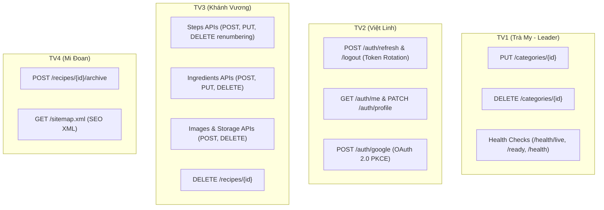

# KẾ HOẠCH CHI TIẾT TRIỂN KHAI & HOÀN TẤT YÊU CẦU NỘP BÀI LAB 4
## DỰ ÁN: CULINARY BLOG (.NET 10 MINIMAL APIS + SUPABASE CLOUD)
> **Môn học:** Phát triển Ứng dụng Web Nâng cao (PTUDWNC) – Nhóm 4  
> **Căn cứ yêu cầu:**  
> 1. Đề bài Lab 4: **Hoàn thành việc cài đặt tất cả API endpoints của toàn bộ hệ thống.**  
> 2. Tài liệu đặc tả gốc: **SRS v1.0.0 (IEEE 830)** & **WBS v2.1** (`docs/tasks_breakdown.md`).  
> **Vị trí lưu trữ tài liệu:** `docs/KE_HOACH_LAB4.md`  

---

## 1. TỔNG QUAN MA TRẬN API TOÀN HỆ THỐNG (30 API ENDPOINTS)

Toàn bộ hệ thống Backend **Culinary Blog** quy định chuẩn mực gồm đúng **30 API endpoints**, được phân chia đồng đều cho 4 thành viên theo từng phân hệ chức năng:

| Thành viên | Phân hệ nghiệp vụ đảm nhiệm | Tổng API quy định | Đã hoàn thành | Cần hoàn thành | Tỷ lệ hiện tại |
| :--- | :--- | :---: | :---: | :---: | :---: |
| **TV1: Nguyễn Thị Trà My** (Trưởng nhóm) | Danh mục (FR-CAT) & Giám sát (FR-OBS) | **8 API** | 8 API | 0 API | 100.0% |
| **TV2: Hoàng Trịnh Việt Linh** | Xác thực người dùng (FR-AUTH) & Email | **7 API** | 2 API | 5 API | 28.6% |
| **TV3: Phan Khánh Vương** | Công thức cốt lõi (FR-RCP), Nguyên liệu, Bước làm & Media | **10 API** | 2 API | 8 API | 20.0% |
| **TV4: Lê Phạm Mi Đoan** | Tìm kiếm FTS, Chi tiết, Xuất bản & Sitemap | **5 API** | 3 API | 2 API | 60.0% |
| **TOÀN HỆ THỐNG** | **4 MODULES - ĐỦ 27 CHỨC NĂNG SRS** | **30 API** | **15 API** | **15 API** | **50.0%** |

---

## 2. CHI TIẾT HIỆN TRẠNG & KẾ HOẠCH CỦA TỪNG THÀNH VIÊN

---

### 👤 THÀNH VIÊN 1 (TRƯỞNG NHÓM): NGUYỄN THỊ TRÀ MY — MSSV: 2312693
* **Module đảm nhiệm:** Quản lý Danh mục (FR-CAT-001 $\rightarrow$ 005) & Giám sát Hệ thống (FR-OBS-001 $\rightarrow$ 003)
* **Tổng số API quy định:** **8 API**

#### A. Danh sách các API ĐÃ HOÀN THÀNH (8/8 API - ĐẠT 100% NHIỆM VỤ LAB 4)
1. `GET /api/v1/categories` (FR-CAT-001): Lấy danh sách 25 danh mục ẩm thực (kèm In-Memory Cache TTL 60 phút, Mapster projection).
2. `GET /api/v1/categories/{slug}` (FR-CAT-002): Xem chi tiết danh mục theo Slug thân thiện SEO kèm danh sách tóm tắt món ăn Published (tự động chuẩn hóa tiếng Việt có dấu).
3. `POST /api/v1/categories` (FR-CAT-003): Tạo mới danh mục ẩm thực (Yêu cầu quyền `Admin`, tự động sinh Slug chống trùng, xóa cache `categories:all`).
4. `PUT /api/v1/categories/{id:guid}` (FR-CAT-004): Cập nhật danh mục ẩm thực (Quyền `Admin`, cập nhật Name, Description, ImageUrl, OrderIndex, giữ nguyên Slug bảo vệ SEO, xóa cache).
5. `DELETE /api/v1/categories/{id:guid}` (FR-CAT-005): Xóa danh mục ẩm thực (Quyền `Admin`, kiểm tra ràng buộc CSDL: ném 409 Conflict nếu còn bài viết liên kết, Soft Delete nếu 0 bài viết).
6. `GET /health/live` (FR-OBS-001): Liveness Probe kiểm tra tiến trình API đang hoạt động (trả về `200 Healthy`, không truy vấn CSDL).
7. `GET /health/ready` (FR-OBS-001): Readiness Probe kiểm tra kết nối CSDL Supabase PostgreSQL qua `SupabaseDatabaseHealthCheck`.
8. `GET /health` (FR-OBS-001): Báo cáo tổng thể tình trạng hạ tầng hệ thống dưới định dạng JSON chi tiết (`status`, `totalDuration`, `timestamp`, `entries`).

#### B. Danh sách các API CẦN HOÀN THÀNH TIẾP THEO
*(Đã hoàn thành 8/8 API - 100% nhiệm vụ của Nhóm trưởng, sẵn sàng hỗ trợ các thành viên khác hoàn thành 15 API còn lại).*

---

### 👤 THÀNH VIÊN 2: HOÀNG TRỊNH VIỆT LINH — MSSV: 2312664
* **Module đảm nhiệm:** Xác thực, Quản lý Tài khoản (FR-AUTH-001 $\rightarrow$ 007) & Background Job (FR-JOB-001)
* **Tổng số API quy định:** **7 API**

#### A. Danh sách các API ĐÃ HOÀN THÀNH (2/7 API)
1. `POST /api/v1/auth/register` (FR-AUTH-001): Đăng ký tài khoản người dùng mới (mật khẩu băm PBKDF2, cấp role mặc định `Author`).
2. `POST /api/v1/auth/login` (FR-AUTH-002): Đăng nhập bằng Email/Password, cấp cặp JWT Access Token (HS256 15m) & Refresh Token (64-byte CSPRNG); khóa tài khoản sau 5 lần sai liên tiếp (`HTTP 423 Locked`).

#### B. Danh sách các API CẦN HOÀN THÀNH TRONG LAB 4 (5 API)
1. `POST /api/v1/auth/google` (FR-AUTH-003): Đăng nhập Google OAuth 2.0 PKCE.
   * *Nghiệp vụ:* Xác thực `IdToken` qua Google API, tự động liên kết tài khoản (Account Linking) nếu email đã tồn tại.
2. `POST /api/v1/auth/refresh` (FR-AUTH-004): Làm mới Access Token (Token Rotation).
   * *Nghiệp vụ:* So khớp Refresh Token băm SHA-256; thu hồi token cũ, cấp token mới; phát hiện tấn công tái sử dụng (Reuse Detection ngoài 30s) $\rightarrow$ thu hồi toàn bộ token của người dùng (HTTP 401).
3. `POST /api/v1/auth/logout` (FR-AUTH-005): Đăng xuất tài khoản.
   * *Nghiệp vụ:* Thu hồi Refresh Token tương ứng trong CSDL (`RevokedAt = UtcNow`).
4. `GET /api/v1/auth/me` (FR-AUTH-006): Lấy thông tin hồ sơ người dùng đang đăng nhập.
   * *Quyền:* `RequireAuthorization`.
   * *Nghiệp vụ:* Trả về `UserDto` (Display Name, Email, Avatar, Bio, Roles; bảo mật tuyệt đối không lộ Hash mật khẩu).
5. `PATCH /api/v1/auth/profile` (FR-AUTH-007): Cập nhật hồ sơ cá nhân.
   * *Quyền:* `RequireAuthorization`.
   * *Nghiệp vụ:* Cập nhật `DisplayName`, `AvatarUrl`, `Bio` (cấm đổi Email/UserName tại API này).

---

### 👤 THÀNH VIÊN 3: PHAN KHÁNH VƯƠNG — MSSV: 2312802
* **Module đảm nhiệm:** Quản lý Công thức Lõi (FR-RCP-003, 004, 007 $\rightarrow$ 010), Media Storage (FR-FILE-001, 002) & Job Resize
* **Tổng số API quy định:** **10 API**

#### A. Danh sách các API ĐÃ HOÀN THÀNH (2/10 API)
1. `POST /api/v1/recipes` (FR-RCP-003): Tạo bản nháp công thức (`RecipeStatus.Draft`, gán `AuthorId = currentUserId`, sinh slug tự động).
2. `PUT /api/v1/recipes/{id:guid}` (FR-RCP-004): Cập nhật công thức (Kiểm tra quyền sở hữu bài viết, Optimistic Concurrency Control qua `RowVersion` $\rightarrow$ ném 409 nếu xung đột).

#### B. Danh sách các API CẦN HOÀN THÀNH TRONG LAB 4 (8 API)
1. `DELETE /api/v1/recipes/{id:guid}` (FR-RCP-007): Xóa công thức.
   * *Quyền:* Tác giả bài viết hoặc Admin (`RecipeAuthorizationHandler`).
   * *Nghiệp vụ:* Soft Delete hoặc Cascade Delete, tự động xóa cache liên quan.
2. `POST /api/v1/recipes/{id:guid}/images` (FR-RCP-008 & FR-FILE-001): Tải ảnh công thức lên Supabase Storage.
   * *Nghiệp vụ:* Thẩm duyệt Magic Bytes (JPEG/PNG/WebP), chống Path Traversal, tải lên bucket `culinary-blog`, tự động gán `IsPrimary = true` cho ảnh đầu tiên.
3. `DELETE /api/v1/recipes/{id:guid}/images/{imageId:guid}` (FR-RCP-008 & FR-FILE-002): Xóa ảnh công thức.
   * *Nghiệp vụ:* Xóa file trên Supabase Storage, nếu xóa ảnh đại diện chính thì tự chọn ảnh tiếp theo làm ảnh chính.
4. `POST /api/v1/recipes/{recipeId:guid}/steps` (FR-RCP-010): Thêm bước làm mới.
   * *Nghiệp vụ:* Tự động gán `StepNumber = Steps.Count + 1`.
5. `PUT /api/v1/recipes/{recipeId:guid}/steps/{stepId:guid}` (FR-RCP-010): Cập nhật nội dung bước nấu ăn (Title, Description, TimerMinutes, ImageUrl).
6. `DELETE /api/v1/recipes/{recipeId:guid}/steps/{stepId:guid}` (FR-RCP-010): Xóa bước làm.
   * *Nghiệp vụ:* Tự động đánh lại số thứ tự liên tục `StepNumber = 1, 2, 3...` (Automatic Renumbering).
7. `POST /api/v1/recipes/{recipeId:guid}/ingredients` (FR-RCP-009): Thêm nguyên liệu món ăn (Name, Quantity, Unit, Notes).
8. `PUT /api/v1/recipes/{recipeId:guid}/ingredients/{ingredientId:guid}` (FR-RCP-009): Sửa nguyên liệu món ăn.
   *(Kèm `DELETE /api/v1/recipes/{recipeId:guid}/ingredients/{ingredientId:guid}`: Xóa nguyên liệu).*

---

### 👤 THÀNH VIÊN 4: LÊ PHẠM MI ĐOAN — MSSV: 2312597
* **Module đảm nhiệm:** Tìm kiếm Toàn văn FTS, Xuất bản & Lưu trữ Công thức (FR-RCP-001, 002, 005, 006, FR-SRCH) & Sitemap
* **Tổng số API quy định:** **5 API**

#### A. Danh sách các API ĐÃ HOÀN THÀNH (3/5 API)
1. `GET /api/v1/recipes`: Tra cứu danh sách công thức, tìm kiếm FTS tiếng Việt không dấu (`unaccent`, `ToTsVector`), phân trang `PaginatedResult`, lọc đa tiêu chí (Output Cache 15 phút).
2. `GET /api/v1/recipes/{slug}`: Xem chi tiết toàn diện công thức (Eager loading Steps, Ingredients, Nutrition, Images bằng `.AsSplitQuery()`, Output Cache theo slug).
3. `PUT /api/v1/recipes/{id:guid}/publish`: Xuất bản công thức (Ràng buộc nghiệp vụ: bắt buộc có $\ge 1$ bước và $\ge 1$ nguyên liệu; đổi trạng thái sang `Published`, gán `PublishedAt`).

#### B. Danh sách các API CẦN HOÀN THÀNH TRONG LAB 4 (2 API)
1. `POST /api/v1/recipes/{id:guid}/archive` (FR-RCP-006): Lưu trữ công thức món ăn.
   * *Quyền:* Tác giả hoặc Admin.
   * *Nghiệp vụ:* Chuyển đổi trạng thái `Status = RecipeStatus.Archived` để ẩn khỏi danh sách công khai.
2. `GET /sitemap.xml` (FR-JOB-003): Xuất sơ đồ trang web chuẩn SEO XML.
   * *Nghiệp vụ:* Quét toàn bộ công thức `Published` và các `Categories` đang hoạt động, sinh cấu trúc chuẩn `<urlset>` kèm `<loc>`, `<lastmod>`, `<changefreq>`, hỗ trợ Google Bot lập chỉ mục.

---

## 3. LỘ TRÌNH THỰC HIỆN LAB 4 (ACTION ROADMAP)

### 🗓️ Lịch trình phân kỳ thực hiện:

* **Đợt 1 (Ưu tiên số 1 - CRUD Cốt lõi & Quản lý bài viết):**
  * TV1: Hoàn thành `PUT` & `DELETE` Categories.
  * TV3: Hoàn thành các API quản lý Steps và Ingredients.
  * TV4: Hoàn thành API `Archive` công thức.
* **Đợt 2 (Ưu tiên số 2 - Bảo mật phiên & Media Upload):**
  * TV2: Hoàn thành `POST /auth/refresh`, `POST /auth/logout`, `GET /auth/me`, `PATCH /auth/profile`.
  * TV3: Hoàn thành upload ảnh lên Supabase Storage (`POST /recipes/{id}/images`).
* **Đợt 3 (Ưu tiên số 3 - Tích hợp bên thứ ba & Giám sát):**
  * TV1: Cài đặt Health Checks (`AspNetCore.HealthChecks.Npgsql`).
  * TV2: Tích hợp Google OAuth (`POST /auth/google`).
  * TV4: Hoàn thành `GET /sitemap.xml`.
* **Đợt 4 (Nghiệm thu toàn diện):**
  * Khởi chạy `dotnet run --project src/CulinaryBlog.API`.
  * Mở tài liệu Scalar UI `http://localhost:5000/scalar/v1`, kiểm tra đủ **30 API endpoints**, gọi thử nghiệm từng endpoint với mã phản hồi thành công và Problem Details khi có lỗi.
