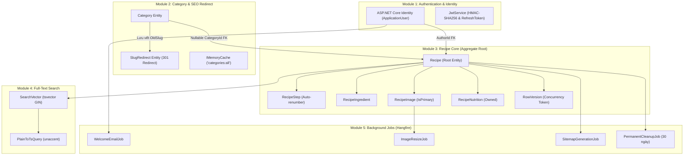
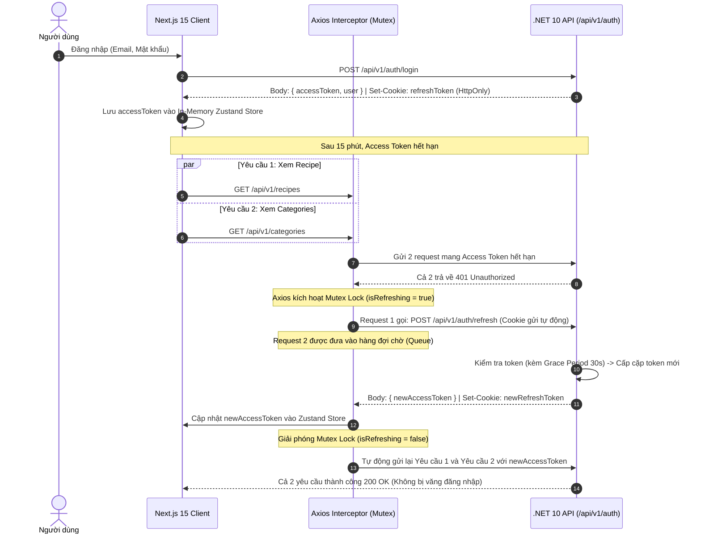

# TÀI LIỆU ĐẶC TẢ TÍCH HỢP HỆ THỐNG VÀ TÍCH HỢP SUPABASE
## DỰ ÁN: CULINARY BLOG – BLOG ẨM THỰC VÀ NẤU ĂN
> **Mã định danh:** `SPEC-TICH-HOP-V2.0`
> **Môn học:** Phát triển Ứng dụng Web Nâng cao (PTUDWNC) – Nhóm 4
> **Hạ tầng Dữ liệu:** **Supabase Cloud (PostgreSQL 16 + Supabase Storage)**
> **Vị trí lưu trữ:** `docs/spec_TichHop/SPEC_TichHop.md`

---

## MỤC LỤC TỔNG QUAN

1. [TỔNG QUAN KIẾN TRÚC TÍCH HỢP HỆ THỐNG (INTEGRATION OVERVIEW)](#1-tổng-quan-kiến-trúc-tích-hợp-hệ-thống-integration-overview)
   - 1.1. Sơ đồ Tích hợp Khối Tổng thể (System Block Integration Diagram)
   - 1.2. Các Giao thức và Chuẩn Giao tiếp Tích hợp
2. [TÍCH HỢP VỚI NỀN TẢNG ĐIỆN TOÁN ĐÁM MÂY SUPABASE](#2-tích-hợp-với-nền-tảng-điện-toán-đám-mây-supabase)
   - 2.1. Tích hợp Cơ sở Dữ liệu Supabase PostgreSQL 16 & EF Core 10
   - 2.2. Kích hoạt & Tích hợp PostgreSQL Extensions (`unaccent`, `pg_trgm`)
   - 2.3. Tích hợp Lưu trữ Tệp tin Supabase Storage (Bucket `culinary-blog`)
   - 2.4. Tích hợp Tiến trình Tác vụ Nền Hangfire trên Supabase PostgreSQL
3. [TÍCH HỢP LIÊN MODULE TRONG HỆ THỐNG BACKEND (.NET 10 CORE)](#3-tích-hợp-liên-module-trong-hệ-thống-backend-net-10-core)
   - 3.1. Tích hợp Module Auth <-> Module Recipe & Category (Identity & Resource-Based AuthZ)
   - 3.2. Tích hợp Module Category <-> Module Recipe (Nullable FK & Slug History 301)
   - 3.3. Tích hợp Module Recipe <-> Module Tệp tin Supabase Storage (Tải ảnh & Dọn dẹp)
   - 3.4. Tích hợp Module Recipe <-> Module Tìm kiếm Toàn văn (SearchVector Computed Column)
   - 3.5. Tích hợp Nghiệp vụ <-> Module Tác vụ Nền Hangfire (Email, Resize, Sitemap, Cleanup)
4. [TÍCH HỢP GIỮA BACKEND (.NET 10) VÀ FRONTEND (NEXT.JS 15)](#4-tích-hợp-giữa-backend-net-10-và-frontend-nextjs-15)
   - 4.1. Chuẩn hóa DTOs & Hợp đồng Dữ liệu (Contract Sharing)
   - 4.2. Luồng Tích hợp Xác thực Lai (Hybrid Token Flow & Axios Mutex Lock)
   - 4.3. Luồng Tích hợp Đồng bộ Cache Webhook (On-Demand ISR Revalidation)
   - 4.4. Chuẩn hóa Xử lý Lỗi Toàn cục (RFC 7807 Problem Details Interception)
5. [MA TRẬN TÍCH HỢP (INTEGRATION MATRIX) & TIÊU CHÍ HOÀN THÀNH](#5-ma-trận-tích-hợp-integration-matrix--tiêu-chí-hoàn-thành)

---

# 1. TỔNG QUAN KIẾN TRÚC TÍCH HỢP HỆ THỐNG (INTEGRATION OVERVIEW)

### 1.1. Sơ đồ Tích hợp Khối Tổng thể (System Block Integration Diagram)

```mermaid
graph TB
    subgraph ClientApp ["Lớp Giao diện Ứng dụng (Next.js 15 App Router)"]
        UI["React 19 Components (Tailwind CSS)"]
        ClientState["Zustand UI Store (In-Memory Access Token)"]
        ServerState["TanStack Query v5 Hooks"]
        AuthModule["Auth.js v5 (NextAuth Session)"]
        RevalidateRoute["Next.js Webhook Receiver (/api/revalidate)"]
    end

    subgraph CoreBackend ["Lớp Dịch vụ Lõi (.NET 10 Minimal APIs)"]
        Gateways["Minimal API Endpoints (/api/v1/*)"]
        Middlewares["Middlewares: CorrelationId, Exception, RateLimit, 301Redirect"]
        MediatRBus["CQRS MediatR Pipeline (Logging -> Validation -> Caching -> Handler)"]
        AuthZHandler["RecipeAuthorizationHandler (Resource-Based Auth)"]
        HangfireEngine["Hangfire Worker Engine (In-Process .NET 10)"]
    end

    subgraph SupabaseCloud ["Nền tảng Điện toán Đám mây Supabase"]
        PostgresDB[("Supabase PostgreSQL 16\n- Host: db.ckhzgvwmaldvbxgoimjo.supabase.co\n- Port: 5432\n- Extensions: unaccent, pg_trgm\n- EF Core 10 Relational Data\n- Hangfire Job Schema")]
        StorageBucket["Supabase Storage Engine\n- Bucket: culinary-blog (Public CDN)\n- Images: Original, 800x600, 300x300"]
    end

    subgraph ExternalAuth ["Xác thực Ngoại vi"]
        GoogleOAuth["Google Cloud Identity (OAuth 2.0 PKCE)"]
    end

    UI --> ServerState
    UI --> ClientState
    ServerState -->|Axios RESTful JSON (Bearer Token)| Gateways
    Gateways --> Middlewares
    Middlewares --> MediatRBus
    MediatRBus --> AuthZHandler
    MediatRBus -->|Npgsql TLS 1.3| PostgresDB
    MediatRBus -->|Supabase Storage API| StorageBucket
    MediatRBus -->|Enqueue Background Jobs| HangfireEngine
    HangfireEngine -->|Job State & Retries| PostgresDB
    HangfireEngine -->|Process Images| StorageBucket

    MediatRBus -->|On-Demand Webhook POST| RevalidateRoute
    RevalidateRoute -->|Purge ISR Tag Cache| UI

    AuthModule --> GoogleOAuth
    Gateways --> GoogleOAuth
```

### 1.2. Các Giao thức và Chuẩn Giao tiếp Tích hợp
1. **Frontend <-> Backend:** Giao thức **HTTPS / RESTful JSON**, sử dụng Header `Authorization: Bearer <accessToken>` và Cookie `HttpOnly, Secure, SameSite=Strict` cho Refresh Token.
2. **Backend <-> Supabase Database:** Giao thức kết nối **PostgreSQL TCP qua TLS 1.3** được bảo vệ bằng mật khẩu và chứng chỉ số máy chủ.
3. **Backend <-> Supabase Storage:** Giao thức **HTTPS REST API** thông qua Supabase Storage SDK hoặc HTTP Client trực tiếp.
4. **Backend <-> Frontend ISR Webhook:** Giao thức **HTTP POST nội bộ** mang Secret Key xác thực để xóa cache HTML tĩnh tức thì.

---

# 2. TÍCH HỢP VỚI NỀN TẢNG ĐIỆN TOÁN ĐÁM MÂY SUPABASE

### 2.1. Tích hợp Cơ sở Dữ liệu Supabase PostgreSQL 16 & EF Core 10
Hệ thống sử dụng **Entity Framework Core 10** với nhà cung cấp **`Npgsql.EntityFrameworkCore.PostgreSQL`** để kết nối trực tiếp đến Supabase Cloud:

```csharp
// Đăng ký kết nối Supabase PostgreSQL trong CulinaryBlog.Infrastructure/DependencyInjection.cs
    ?? Environment.GetEnvironmentVariable("SUPABASE_CONNECTION_STRING");

services.AddDbContext<ApplicationDbContext>(options =>
    options.UseNpgsql(connectionString, npgsqlOptions =>
    {
        npgsqlOptions.MigrationsAssembly(typeof(ApplicationDbContext).Assembly.FullName);
        npgsqlOptions.EnableRetryOnFailure(maxRetryCount: 5, maxRetryDelay: TimeSpan.FromSeconds(10), errorCodesToAdd: null);
    }));
```

### 2.2. Kích hoạt & Tích hợp PostgreSQL Extensions (`unaccent`, `pg_trgm`)
Để hỗ trợ tìm kiếm toàn văn tiếng Việt không dấu, hệ thống cấu hình migration tự động kích hoạt 2 extension của PostgreSQL trong `ApplicationDbContext.OnModelCreating`:
```csharp
modelBuilder.HasPostgresExtension("unaccent");
modelBuilder.HasPostgresExtension("pg_trgm");
```
Cột tính toán `SearchVector` trên Supabase được cấu hình với chỉ mục GIN:
```csharp
builder.Entity<Recipe>()
    .HasGeneratedTsVectorColumn(
        r => r.SearchVector,
        "english", // Kết hợp unaccent trong query LINQ EF Core
        r => new { r.Title, r.Description })
    .HasIndex(r => r.SearchVector)
    .HasMethod("GIN");
```

### 2.3. Tích hợp Lưu trữ Tệp tin Supabase Storage (Bucket `culinary-blog`)
Toàn bộ hình ảnh công thức được lưu trữ và phân phối thông qua **Supabase Storage**:
- **Cấu hình Bucket:** Tạo bucket mang tên `culinary-blog` với chính sách truy cập công khai (**Public Bucket**).
- **Trừu tượng hóa Service (`ISupabaseStorageService`):**
  ```csharp
  public interface ISupabaseStorageService
  {
      Task<string> UploadFileAsync(Stream fileStream, string fileName, string contentType, CancellationToken cancellationToken);
      Task DeleteFileAsync(string fileUrl, CancellationToken cancellationToken);
      string GetPublicUrl(string filePath);
  }
  ```
- **Quy tắc Lưu trữ:** Mỗi tệp ảnh tải lên được gán đường dẫn duy nhất chống trùng lặp và chống duyệt thư mục (Path Traversal):
  `StoragePath = recipes/{recipeId}/{Guid.NewGuid()}.{extension}`
- **CDN Tải Ảnh Tốc độ Cao:** Trình duyệt và máy chủ Next.js nạp ảnh trực tiếp qua CDN của Supabase:
  `https://ckhzgvwmaldvbxgoimjo.supabase.co/storage/v1/object/public/culinary-blog/...`

### 2.4. Tích hợp Tiến trình Tác vụ Nền Hangfire trên Supabase PostgreSQL
Tiến trình Hangfire chạy ngay trong tiến trình Backend .NET 10 (`In-Process Worker`), lưu trữ trạng thái hàng đợi trực tiếp trên CSDL Supabase PostgreSQL:
```csharp
services.AddHangfire(config => config
    .SetDataCompatibilityLevel(CompatibilityLevel.Version_180)
    .UseSimpleAssemblyNameTypeSerializer()
    .UseRecommendedSerializerSettings()
    .UsePostgreSqlStorage(c => c.UseNpgsqlConnection(connectionString)));

services.AddHangfireServer(options =>
{
    options.WorkerCount = Environment.ProcessorCount * 2;
    options.Queues = new[] { "critical", "default", "cleanup" };
});
```

---

# 3. TÍCH HỢP LIÊN MODULE TRONG HỆ THỐNG BACKEND (.NET 10 CORE)



### 3.1. Tích hợp Module Auth <-> Module Recipe & Category
- **Truyền Ngữ Cảnh Người Dùng (`ICurrentUser`):** Tầng API trích xuất `UserId` và `UserRole` từ JWT Claims và inject vào tầng Application.
- **Phân Quyền Theo Tài Nguyên (`RecipeAuthorizationHandler`):**
  - Khi tác giả gửi yêu cầu Cập nhật hoặc Xóa công thức, `RecipeAuthorizationHandler` so khớp:
    ```csharp
    currentUserId == recipe.AuthorId || currentUserRole == "Admin"
    ```
  - Ngăn chặn hoàn toàn lỗi bảo mật truy cập trực tiếp đối tượng bất hợp pháp (IDOR).

### 3.2. Tích hợp Module Category <-> Module Recipe
- **Quan hệ Khóa Ngoại Nullable (`Guid? CategoryId`):**
  - Đảm bảo khi Admin xóa một danh mục, CSDL Supabase không bị lỗi ràng buộc toàn vẹn. Các bài viết trực thuộc danh mục đó (bao gồm cả các bài đã xóa mềm cũ) tự động chuyển sang `CategoryId = NULL` hoặc chuyển về danh mục *"Chưa phân loại"*.
- **Tích hợp Slug History & Chuyển Hướng 301:**
  - Khi đổi tên danh mục hoặc đổi tiêu đề bài viết, hệ thống ghi nhận vào bảng `SlugRedirects`. Middleware `SlugRedirectMiddleware` đón đầu request kiểm tra trước khi trả về 404, nếu khớp Slug cũ sẽ phản hồi HTTP 301 chuyển hướng ngay lập tức sang Slug mới.

### 3.3. Tích hợp Module Recipe <-> Module Tệp tin Supabase Storage
- Tải lên nhiều ảnh thông qua `RecipeEndpoints`: File được đọc kiểm tra Magic Bytes, tải lên bucket `culinary-blog` trên Supabase Storage, sau đó tạo bản ghi `RecipeImage`.
- Ảnh đầu tiên tải lên tự động nhận cờ `IsPrimary = true`. Khi ảnh chính bị xóa, hệ thống tự động gán cờ `IsPrimary` cho ảnh đầu tiên còn lại trong bộ sưu tập.

### 3.4. Tích hợp Module Recipe <-> Module Tìm kiếm Toàn văn (FTS)
- Cột `SearchVector` trên Supabase được tự động tính toán lại mỗi khi `Title` hoặc `Description` thay đổi thông qua cơ chế Generated Column của PostgreSQL.
- Repository `RecipeRepository.SearchRecipesAsync` áp dụng kỹ thuật `.AsSplitQuery()` kết hợp hàm `EF.Functions.ToTsVector()` và `EF.Functions.PlainToTsQuery()` để tìm kiếm không dấu với tốc độ cực nhanh.

---

# 4. TÍCH HỢP GIỮA BACKEND (.NET 10) VÀ FRONTEND (NEXT.JS 15)

### 4.1. Chuẩn hóa DTOs & Hợp đồng Dữ liệu (Contract Sharing)
Các kiểu dữ liệu trong `src/frontend/types/api.ts` khớp chính xác 100% với các C# DTOs tại `src/CulinaryBlog.Application/DTOs/`:
- `CategoryDto` <-> `CategoryDto.cs`
- `RecipeListDto` <-> `RecipeListDto.cs`
- `RecipeDetailDto` <-> `RecipeDetailDto.cs`
- `PaginatedResult<T>` <-> `PaginatedResult<T>.cs`
- `CreateRecipeFormData` (Zod) <-> `CreateRecipeCommand.cs`

### 4.2. Luồng Tích hợp Xác thực Lai (Hybrid Token Flow & Axios Mutex Lock)



### 4.3. Luồng Tích hợp Đồng bộ Cache Webhook (On-Demand ISR Revalidation)
1. Tác giả thực hiện cập nhật/xuất bản bài viết hoặc Admin sửa danh mục trên giao diện.
2. Backend .NET 10 xử lý commit CSDL Supabase và xóa cache Redis/IMemoryCache nội bộ thành công.
3. Backend kích hoạt gọi Webhook bất đồng bộ sang Next.js App Router:
   ```http
   POST http://localhost:3000/api/revalidate?tag=recipes&secret=CULINARY_SECRET_WEBHOOK_2026
   ```
4. Route handler `src/frontend/app/api/revalidate/route.ts` xác thực secret key và thực thi lệnh:
   ```typescript
   revalidateTag('recipes');
   revalidatePath('/');
   ```
5. Độc giả F5 lại trang chủ lập tức thấy bài viết mới được cập nhật, trong khi toàn bộ hệ thống vẫn duy trì tốc độ phân phối trang HTML tĩnh siêu tốc của ISR.

### 4.4. Chuẩn hóa Xử lý Lỗi Toàn cục (RFC 7807 Problem Details Interception)
Khi API trả về lỗi nghiệp vụ (ví dụ: `HTTP 409 RECIPE_CONCURRENCY_CONFLICT` hoặc `HTTP 422 RECIPE_PUBLISH_INCOMPLETE`), Axios Interceptor tại Frontend trích xuất cấu trúc Problem Details:
```typescript
interface ProblemDetails {
  type: string;
  title: string;
  status: number;
  detail: string;
  errors?: Record<string, string[]>;
}
```
Thông tin chi tiết được hiển thị trực tiếp lên UI (Toast message hoặc form validation error), giúp người dùng nắm rõ chính xác nguyên nhân lỗi.

---

# 5. MA TRẬN TÍCH HỢP (INTEGRATION MATRIX) & TIÊU CHÍ HOÀN THÀNH

### 5.1. Ma trận Tích hợp Endpoints & Điểm Chạm Hệ Thống

| Module Phát Khởi | Endpoint / Hành Vi Tích Hợp | Dịch Vụ Tiếp Nhận | Kết Quả Tích Hợp Kỳ Vọng |
| :--- | :--- | :--- | :--- |
| **Auth** | `POST /api/v1/auth/register` | Supabase DB + Hangfire | Tạo `ApplicationUser`, lưu RefreshToken, enqueue `WelcomeEmailJob`. |
| **Auth** | `POST /api/v1/auth/refresh` | Supabase DB + Cookie | Xoay vòng RefreshToken, hỗ trợ Grace Period 30s, cấp new AccessToken. |
| **Category** | `PUT /api/v1/categories/{id}` | Supabase DB + Next.js | Cập nhật Category, lưu `SlugRedirects` (301), gọi Webhook Revalidate. |
| **Category** | `DELETE /api/v1/categories/{id}` | Supabase DB | Kiểm tra bài viết hoạt động; cập nhật bài viết cũ về `CategoryId = NULL`. |
| **Recipe** | `POST /api/v1/recipes` (Draft) | Supabase DB | Lưu bản nháp chỉ với Tiêu đề, tạo `Recipe` ở trạng thái `Draft`. |
| **Recipe** | `POST /api/v1/recipes/{id}/publish`| Supabase DB + Webhook | Kiểm tra >= 1 bước, >= 1 nguyên liệu; đổi trạng thái `Published`, gọi Revalidate. |
| **Recipe** | `POST /api/v1/recipes/{id}/images` | Supabase Storage | Kiểm tra Magic Bytes, tải ảnh lên bucket `culinary-blog`, lưu `RecipeImage`. |
| **Recipe** | `DELETE /api/v1/recipes/{id}` | Supabase DB + Hangfire | Soft Delete bài viết (30 ngày); Hangfire quét xóa vĩnh viễn và dọn ảnh Storage. |
| **Search** | `GET /api/v1/recipes` | Supabase DB (GIN FTS) | Query FTS không dấu qua `unaccent`, Projection Mapster bỏ qua Nutrition. |

### 5.2. Tiêu Chí Hoàn Thành Tích Hợp (Definition of Done)
1. **Toàn vẹn CSDL:** Schema EF Core đồng bộ hoàn toàn với Supabase PostgreSQL, không còn tồn tại bất kỳ bảng hay container Docker cục bộ nào.
2. **Toàn vẹn Tệp tin:** Ảnh được lưu trữ an toàn trên Supabase Storage và hiển thị thông qua Next.js `<Image />` component với remote pattern `**.supabase.co`.
3. **Đồng bộ Phiên:** Cơ chế Hybrid Token vận hành trơn tru: F5 trang web không bị mất phiên đăng nhập, gọi nhiều API đồng thời không bị lỗi xung đột xoay vòng token.
4. **Đồng bộ Dữ liệu Tức thì:** Thao tác đăng bài hoặc cập nhật danh mục kích hoạt Webhook xóa cache tĩnh Next.js ISR ngay tức thì.

---
*Tài liệu đặc tả tích hợp hệ thống và Supabase được lưu trữ chính thức tại:* `d:\Nhom4_WebNangCao\docs\spec_TichHop\SPEC_TichHop.md`
