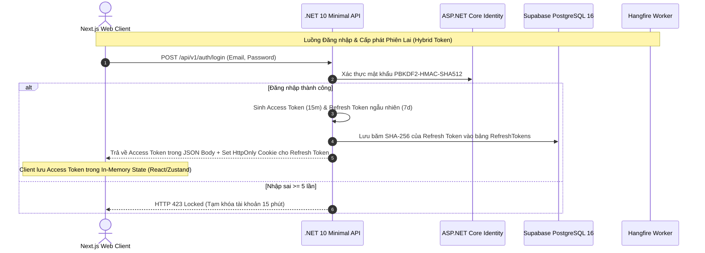
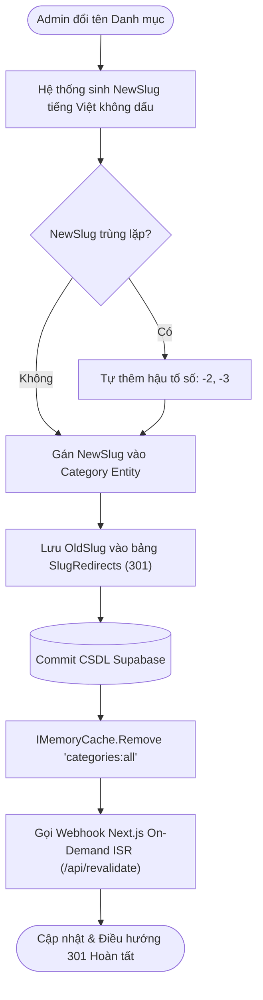
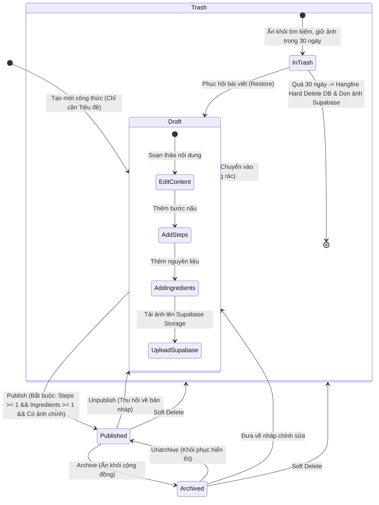
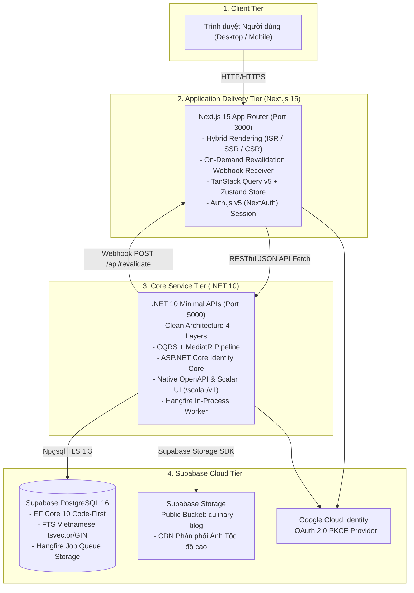
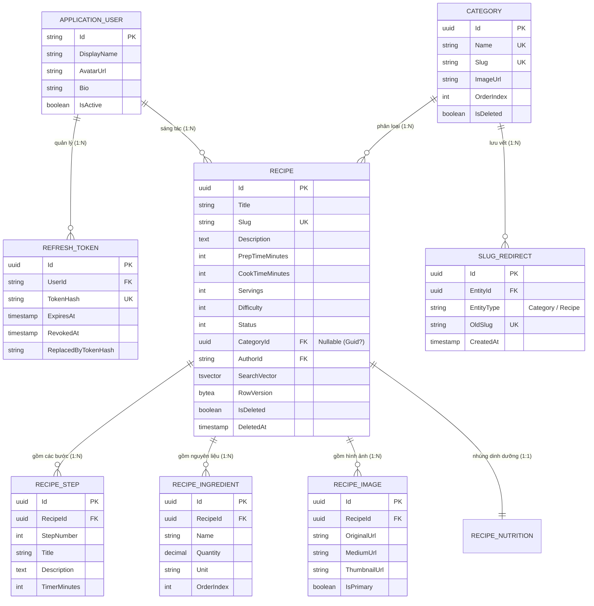

# TÀI LIỆU ĐẶC TẢ HỆ THỐNG VÀ LOGIC NGHIỆP VỤ ĐỒNG BỘ
## DỰ ÁN: CULINARY BLOG – NỀN TẢNG CHIA SẺ VÀ KHÁM PHÁ CÔNG THỨC ẨM THỰC
> **Mã định danh:** `SPEC-CULINARY-BLOG-V2.0`  
> **Môn học:** Phát triển Ứng dụng Web Nâng cao (PTUDWNC) – Nhóm 4  
> **Căn cứ tài liệu:** SRS v1.0.0 (IEEE 830) và Báo cáo Đánh đổi Kiến trúc đã thống nhất  
> **Hạ tầng Dữ liệu:** **Supabase Cloud (PostgreSQL 16 + Supabase Storage)**  
> **Vị trí lưu trữ:** `docs/specs/SPEC_CULINARY_BLOG.md`  

---

## MỤC LỤC TỔNG QUAN

1. [TỔNG QUAN HỆ THỐNG VÀ BỐI CẢNH KỸ THUẬT](#1-tổng-quan-hệ-thống-và-bối-cảnh-kỹ-thuật)
   - 1.1. Tuyên bố Sứ mệnh & Mục tiêu Sản phẩm
   - 1.2. Hạ tầng Dữ liệu Đám mây Supabase
   - 1.3. Phạm vi Hệ thống (In-Scope & Out-of-Scope)
   - 1.4. Ma trận Tác nhân và Phân quyền 3 Tầng
2. [ĐẶC TẢ LOGIC NGHIỆP VỤ CHUẨN XÁC (FINAL BUSINESS LOGIC)](#2-đặc-tả-logic-nghiệp-vụ-chuẩn-xác-final-business-logic)
   - 2.1. Module Xác thực và Quản lý Danh tính (FR-AUTH)
   - 2.2. Module Quản lý Danh mục & Điều hướng SEO (FR-CAT)
   - 2.3. Module Quản lý Công thức Lõi (FR-RCP)
   - 2.4. Module Tìm kiếm Toàn văn Thông minh & Phân trang (FR-SRCH)
   - 2.5. Module Quản lý Tệp tin Đa phương tiện (FR-FILE)
   - 2.6. Module Tác vụ Nền Bất đồng bộ (FR-JOB)
   - 2.7. Module Giám sát và Khả năng Quan sát Hệ thống (FR-OBS)
   - 2.8. Danh mục Chuẩn hóa Mã lỗi Nghiệp vụ (RFC 7807 Problem Details)
3. [ĐẶC TẢ KIẾN TRÚC HỆ THỐNG (SYSTEM ARCHITECTURE)](#3-đặc-tả-kiến-trúc-hệ-thống-system-architecture)
   - 3.1. Kiến trúc Tổng thể API-Driven Architecture
   - 3.2. Kiến trúc Backend: Clean Architecture & Domain-Driven Design (DDD)
   - 3.3. Pipeline Xử lý CQRS & MediatR Pipeline Behaviors
   - 3.4. Kiến trúc Frontend: Next.js 15 App Router & Hybrid Rendering
   - 3.5. Thiết kế CSDL & Mô hình Thực thể Quan hệ (ERD & Data Dictionary)
   - 3.6. Chiến lược Caching Đa tầng & Tối ưu Hiệu năng
   - 3.7. Kiến trúc An toàn & Bảo mật Hệ thống (OWASP Top 10)
4. [KẾT LUẬN & ĐỊNH HƯỚNG TRIỂN KHAI](#4-kết-luận--định-hướng-triển-khai)

---

# 1. TỔNG QUAN HỆ THỐNG VÀ BỐI CẢNH KỸ THUẬT

### 1.1. Tuyên bố Sứ mệnh & Mục tiêu Sản phẩm
- **Tên sản phẩm:** Culinary Blog – Nền tảng Chia sẻ và Khám phá Công thức Ẩm thực Chuyên nghiệp.
- **Mã định danh:** `CULINARY-BLOG-V2`.
- **Kiến trúc:** **API-Driven Architecture** hoàn toàn phân tách giữa Backend (.NET 10 Minimal APIs) và Frontend (Next.js 15 App Router).
- **Mục tiêu chính:** Cung cấp môi trường trực tuyến tốc độ cao cho cộng đồng yêu ẩm thực; hỗ trợ tìm kiếm không dấu tiếng Việt bản địa hóa; cung cấp công cụ tạo bài viết chuyên nghiệp với định lượng nguyên liệu, các bước nấu có hẹn giờ, phân tích dinh dưỡng và tối ưu hóa SEO đạt điểm số Google Core Web Vitals xuất sắc.

### 1.2. Hạ tầng Dữ liệu Đám mây Supabase
Hệ thống chuyển đổi toàn diện sang nền tảng **Supabase Cloud**, loại bỏ triệt để các cấu hình phức tạp của Docker và PostgreSQL cục bộ:
- **Hệ quản trị CSDL Quan hệ:** **Supabase PostgreSQL 16**, kết nối an toàn qua giao thức SSL/TLS 1.3 (thông số cấu hình qua biến môi trường `.env`).
- **Lưu trữ Đối tượng Đa phương tiện:** **Supabase Storage** (Bucket công khai `culinary-blog`), thay thế hoàn toàn MinIO S3 cục bộ.
- **Tiện ích mở rộng PostgreSQL được kích hoạt:** `unaccent` (hỗ trợ tìm kiếm tiếng Việt không dấu) và `pg_trgm` (tìm kiếm mờ trigram).

### 1.3. Phạm vi Hệ thống (In-Scope & Out-of-Scope)

```mermaid
graph TD
    subgraph IN_SCOPE ["Phạm vi Hiện thực (In-Scope v1.0.0)"]
        A1[Xác thực JWT + Google OAuth + Token Rotation + Grace Period]
        A2[Quản lý Danh mục + Auto-Slug + Điều hướng 301 Redirect]
        A3[Quản lý Công thức: Draft -> Published -> Archived]
        A4[Thùng rác 30 ngày Two-Stage Deletion cho Recipe & Tệp]
        A5[Upload ảnh an toàn lên Supabase Storage + Magic Bytes]
        A6[FTS tiếng Việt với Supabase PostgreSQL tsvector/unaccent]
        A7[Output Cache + Next.js On-Demand ISR Revalidation Webhook]
        A8[Giám sát: Serilog CorrelationId, OpenTelemetry, Healthchecks]
    end

    subgraph OUT_OF_SCOPE ["Nằm ngoài phạm vi (Out-of-Scope)"]
        B1[Bình luận nhiều cấp lồng nhau & Đánh giá sao xếp hạng]
        B2[Bookmark / Lưu công thức vào bộ sưu tập cá nhân]
        B3[Thông báo thời gian thực qua WebSocket / SignalR]
        B4[Ứng dụng Di động Native (iOS / Android)]
        B5[Cổng thanh toán & Thương mại điện tử nguyên liệu]
        B6[Hệ thống tin nhắn trực tiếp giữa người dùng (Chat)]
    end

    style IN_SCOPE fill:#e8f5e9,stroke:#2e7d32,stroke-width:2px;
    style OUT_OF_SCOPE fill:#ffebee,stroke:#c62828,stroke-width:2px;
```

### 1.4. Ma trận Tác nhân và Phân quyền 3 Tầng

| Tác nhân (Actor) | Định danh & Điều kiện | Quyền hạn Nghiệp vụ Chính |
| :--- | :--- | :--- |
| **Khách vãng lai (Guest)** | Người dùng chưa đăng nhập. | - Xem danh sách & chi tiết các công thức đã xuất bản (**`Published`**).<br>- Xem danh mục món ăn.<br>- Tìm kiếm công thức qua Full-Text Search.<br>- *Tuyệt đối không có quyền ghi/sửa/xóa dữ liệu.* |
| **Tác giả (Author)** | Người dùng đã đăng nhập hợp lệ (role `Author`). | - Kế thừa toàn bộ quyền của **Guest**.<br>- Tạo mới công thức (khởi tạo ở trạng thái **`Draft`** chỉ với Tiêu đề).<br>- Chỉnh sửa, xuất bản (`Publish`), lưu trữ (`Archive`) hoặc xóa công thức **DO CHÍNH MÌNH TẠO RA**.<br>- Tải lên, xóa và gán ảnh đại diện bài viết trên Supabase Storage.<br>- Cập nhật hồ sơ cá nhân (DisplayName, Avatar, Bio). |
| **Quản trị viên (Admin)** | Tài khoản quản trị tối cao (được định danh sẵn). | - Kế thừa toàn bộ quyền của **Author**.<br>- Toàn quyền quản trị danh mục ẩm thực (CRUD Category, sắp xếp thứ tự, quản lý 301 Redirect).<br>- Có quyền can thiệp, gỡ bỏ, xóa bất kỳ công thức nào của bất kỳ tác giả nào (**Bypass Ownership**).<br>- Khóa / Vô hiệu hóa tài khoản vi phạm.<br>- Truy cập giao diện quản trị tác vụ nền Hangfire Dashboard (`/hangfire`). |

---

# 2. ĐẶC TẢ LOGIC NGHIỆP VỤ CHUẨN XÁC (FINAL BUSINESS LOGIC)

Sau khi giải quyết triệt để 8 mâu thuẫn kiến trúc, toàn bộ luồng nghiệp vụ của hệ thống được thống nhất dứt điểm như sau:

### 2.1. Module Xác thực và Quản lý Danh tính (FR-AUTH)



#### Quy tắc Nghiệp vụ Module Auth:
1. **Mô hình Token Lai (Hybrid Token Pattern - Giải quyết dứt điểm mâu thuẫn CSRF vs XSS):**
   - **Access Token (15 phút):** Lưu trữ hoàn toàn trong **Bộ nhớ tạm (In-Memory State)** của ứng dụng Frontend (Zustand store). Tắt tab hoặc reload là mất, hoàn toàn miễn nhiễm với việc bị đánh cắp qua lỗ hổng XSS từ `localStorage`.
   - **Refresh Token (7 ngày):** Lưu trữ trong **`HttpOnly, Secure, SameSite=Strict Cookie`**. Trình duyệt tự động gửi kèm cookie này khi gọi endpoint `/api/v1/auth/refresh`. JavaScript hoàn toàn không đọc được cookie này, triệt tiêu đồng thời cả nguy cơ XSS lẫn CSRF.
2. **Cơ chế Token Rotation kèm Thời gian Ân hạn (Grace Period 30s - Chống Race Condition):**
   - Khi client gọi `/api/v1/auth/refresh`, server phát sinh Refresh Token mới và thu hồi token cũ.
   - **Grace Period (30 giây):** Nhằm giải quyết triệt để vấn đề nhiều API requests đồng thời bị lỗi 401 khi vừa hết hạn Access Token, hệ thống cho phép token vừa bị thu hồi vẫn hợp lệ trong vòng **30 giây** nếu đến từ cùng IP và User-Agent.
   - **Phát hiện tái sử dụng thực sự (Reuse Detection):** Nếu token cũ bị gửi lại sau 30 giây, hệ thống nhận diện đây là hành vi Replay Attack của kẻ tấn công, lập tức thu hồi toàn bộ gia đình token (**Token Family Invalidation**), đá văng kẻ tấn công và bắt nạn nhân đăng nhập lại.
3. **Đăng nhập Google OAuth 2.0 (FR-AUTH-003):**
   - Triển khai theo chuẩn OAuth 2.0 PKCE.
   - Tự động liên kết tài khoản (Account Linking): Nếu email Google đã tồn tại trong CSDL, hệ thống liên kết tài khoản thay vì báo lỗi trùng lặp.

---

### 2.2. Module Quản lý Danh mục & Điều hướng SEO (FR-CAT)



#### Quy tắc Nghiệp vụ Module Danh mục:
1. **Cơ chế Lịch sử Slug & Điều hướng Tự động HTTP 301 (Giải quyết dứt điểm mâu thuẫn SEO vs URL):**
   - Khi Admin đổi tên danh mục (ví dụ từ *"Món Tráng Miệng"* thành *"Đồ Uống & Trà"*), hệ thống **sinh Slug mới** (`do-uong-va-tra`) để tối ưu hóa SEO cho nội dung mới.
   - Đồng thời, hệ thống tự động lưu vết Slug cũ vào bảng **`SlugRedirects`** (`Id`, `EntityId`, `EntityType`, `OldSlug`, `CreatedAt`).
   - Khi độc giả hoặc Google Bot truy cập đường dẫn cũ (`/categories/mon-trang-mieng`), Middleware tự động tra cứu bảng `SlugRedirects` và phản hồi mã **HTTP 301 Moved Permanently** chuyển hướng sang URL mới. Liên kết cũ không bao giờ bị 404, và bài viết mới đạt điểm SEO tuyệt đối!
2. **Ràng buộc Xóa Danh mục An toàn (Data Integrity):**
   - Cột `CategoryId` trong bảng `Recipes` được cấu hình là **`Nullable` (`Guid?`)**.
   - Khi Admin xóa một danh mục: Hệ thống kiểm tra số công thức đang hoạt động (`!IsDeleted`). Nếu bằng 0, cho phép xóa danh mục, đồng thời tự động cập nhật `CategoryId = NULL` (hoặc chuyển về ID danh mục mặc định *"Chưa phân loại"*) đối với tất cả các bài viết cũ đã xóa mềm.
3. **Đồng bộ Cache Tức thì qua Webhook:**
   - Sau khi cập nhật danh mục, server xóa `IMemoryCache` nội bộ và đồng thời phát HTTP POST bí mật gọi Webhook sang Next.js (`POST /api/revalidate?tag=categories`) để Next.js render lại trang HTML tĩnh ngay lập tức.

---

### 2.3. Module Quản lý Công thức Lõi (FR-RCP)



#### Quy tắc Nghiệp vụ Module Công thức:
1. **Tách rời 2 Bộ Validation Rules (Giải quyết dứt điểm mâu thuẫn Bản Nháp vs Ràng buộc):**
   - **Khi Lưu Nháp (`Draft`):** Tác giả chỉ cần nhập **Tiêu đề** (`Title`). Các trường bước nấu, nguyên liệu, thời gian được phép để trống. Điều này cho phép tác giả lưu lại ý tưởng nhanh chóng mà không bị gò bó.
   - **Khi Bấm Xuất Bản (`Publish`):** Kích hoạt bộ kiểm tra nghiêm ngặt: Bắt buộc >= 1 bước thực hiện, >= 1 nguyên liệu và có ít nhất 1 ảnh đại diện `IsPrimary = true`. Nếu thiếu, trả về `HTTP 422 Unprocessable Entity` (`RECIPE_PUBLISH_INCOMPLETE`).
2. **Quy trình Thùng Rác 30 Ngày (Two-Stage Deletion - Giải quyết dứt điểm Soft Delete vs Hard Delete):**
   - **Giai đoạn 1 (Tác giả bấm Xóa):** Thực hiện **Xóa mềm** (`IsDeleted = true`, `DeletedAt = UtcNow`). Bài viết lập tức bị ẩn khỏi trang chủ và kết quả tìm kiếm, nhưng dữ liệu trong DB và tệp ảnh trên Supabase Storage **vẫn được bảo toàn nguyên vẹn**. Tác giả có thể bấm "Khôi phục" bất kỳ lúc nào trong 30 ngày.
   - **Giai đoạn 2 (Tác vụ nền Hangfire):** Hàng ngày lúc 03:00 AM UTC, `PermanentCleanupJob` quét các bài viết có `DeletedAt < UtcNow - 30 ngày` để thực hiện **Hard Delete vĩnh viễn** khỏi Supabase PostgreSQL và phát lệnh xóa sạch các tệp ảnh vật lý trên Supabase Storage.
3. **Kiểm soát Xung đột Đồng thời Lạc quan (Optimistic Concurrency Control):**
   - Bảng `Recipes` sở hữu trường concurrency token `RowVersion` (dạng bytea/xmin của PostgreSQL).
   - Khi cập nhật (`PUT /api/v1/recipes/{id}`), nếu `RowVersion` của client không khớp với CSDL Supabase, API trả về `HTTP 409 Conflict` (`RECIPE_CONCURRENCY_CONFLICT`), ngăn chặn hoàn toàn lỗi ghi đè dữ liệu của người khác (Lost Update).
4. **Tự động Đánh lại Thứ tự Bước nấu (Step Renumbering Automation):**
   - Khi xóa một bước nấu bất kỳ (ví dụ xóa bước 2 trong 5 bước), hệ thống tự động đánh lại số thứ tự liên tục 1, 2, 3, 4 cho các bước còn lại trước khi commit vào Supabase.

---

### 2.4. Module Tìm kiếm Toàn văn Thông minh & Phân trang (FR-SRCH)
1. **Tìm kiếm Tiếng Việt Không Dấu với Supabase PostgreSQL:**
   - Kích hoạt extension `unaccent` và `pg_trgm` trên Supabase.
   - Cột tính toán `SearchVector` tự động cập nhật trọng số: Tiêu đề (Trọng số `A`) và Mô tả (Trọng số `B`).
   - Đánh chỉ mục **GIN Index** trên `SearchVector`, xếp hạng theo độ liên quan `ts_rank(SearchVector, query) DESC`.
2. **Tối ưu Hóa Hiệu Năng Truy Vấn (Giải quyết dứt điểm mâu thuẫn Owned Nutrition vs Wide Table):**
   - Bảng `Recipes` chứa các cột `Nutrition_*` (Calories, Protein, Fat, Carb) dạng Owned Entity.
   - Khi truy vấn danh sách bài viết (`GET /api/v1/recipes`), tầng Application **bắt buộc sử dụng Mapster Projection (`.ProjectToType<RecipeListDto>()`)** để Entity Framework Core chỉ sinh câu lệnh SQL `SELECT` các cột hiển thị bề mặt, loại bỏ hoàn toàn việc nạp các cột dinh dưỡng thừa, giúp tốc độ truy vấn đạt < 30ms.

---

### 2.5. Module Quản lý Tệp tin Đa phương tiện (FR-FILE)
- **Tích hợp Supabase Storage:** Thay thế hoàn toàn MinIO S3. Toàn bộ hình ảnh được tải lên bucket công khai `culinary-blog` trên Supabase Storage.
- **Thẩm duyệt An toàn Tệp (Magic Bytes):** Đọc trực tiếp mảng bytes nhị phân đầu tiên của tệp (`FF D8 FF` cho JPEG, `89 50 4E 47` cho PNG) để ngăn chặn mã độc.
- **Chống Tấn công Duyệt Thư mục (Path Traversal):** Tên file gốc bị loại bỏ hoàn toàn, hệ thống tự động sinh tên ngẫu nhiên dạng GUID v4: `recipes/{recipeId}/{Guid.NewGuid()}.webp`.

---

### 2.6. Module Tác vụ Nền Bất đồng bộ (FR-JOB)
Hệ thống sử dụng **Hangfire** lưu trữ trạng thái hàng đợi trực tiếp trên Supabase PostgreSQL:
- **`WelcomeEmailJob` (Fire-and-forget):** Gửi email chào mừng ngay sau khi đăng ký tài khoản.
- **`ImageResizeJob` (Fire-and-forget):** Tạo 2 phiên bản ảnh nén WebP: **Medium (800×600)** và **Thumbnail (300×300)** tải lên Supabase Storage.
- **`SitemapGenerationJob` (Recurring - 02:00 AM UTC):** Sinh file `sitemap.xml` chuẩn SEO chứa toàn bộ công thức `Published` và ping Google Search Console.
- **`PermanentCleanupJob` (Recurring - 03:00 AM UTC):** Quét và dọn dẹp vĩnh viễn các bài viết trong thùng rác quá 30 ngày kèm tệp ảnh trên Supabase Storage.

---

### 2.7. Module Giám sát và Khả năng Quan sát Hệ thống (FR-OBS)
- **Health Checks 3 Cấp độ:**
  - `/health/live`: Liveness probe kiểm tra process API.
  - `/health/ready`: Readiness probe kiểm tra kết nối trực tiếp đến Supabase PostgreSQL và Redis.
  - `/health`: Báo cáo chi tiết trạng thái tất cả các thành phần phụ thuộc.
- **Structured Logging (Serilog):** Log JSON có gắn `CorrelationId` (`X-Correlation-ID`). Cảnh báo mức `WARNING` đối với các request xử lý chậm > 500ms.
- **OpenTelemetry Tracing:** Đo đạc vết phân tán từ HTTP request qua EF Core xuống Supabase CSDL.

---

### 2.8. Danh mục Chuẩn hóa Mã lỗi Nghiệp vụ (RFC 7807 Problem Details)

Mọi phản hồi lỗi từ API đều tuân thủ chuẩn quốc tế `application/problem+json`:

| Mã Lỗi (Error Code) | HTTP Status | Diễn giải Chi tiết |
| :--- | :---: | :--- |
| `AUTH_EMAIL_EXISTS` | 409 Conflict | Email này đã được đăng ký trong hệ thống. |
| `AUTH_INVALID_CREDENTIALS` | 401 Unauthorized | Thông tin đăng nhập hoặc mật khẩu không chính xác. |
| `AUTH_TOKEN_EXPIRED` | 401 Unauthorized | Access Token đã hết hạn. |
| `AUTH_REFRESH_TOKEN_EXPIRED` | 401 Unauthorized | Refresh Token đã hết hạn, người dùng cần đăng nhập lại. |
| `AUTH_REFRESH_TOKEN_REVOKED` | 401 Unauthorized | Phát hiện token cũ ngoài thời gian ân hạn 30s (Reuse Detection). |
| `AUTH_ACCOUNT_LOCKED` | 423 Locked | Tài khoản bị tạm khóa 15 phút do nhập sai mật khẩu 5 lần. |
| `RECIPE_NOT_FOUND` | 404 Not Found | Không tìm thấy công thức với Id hoặc Slug yêu cầu. |
| `RECIPE_PUBLISH_INCOMPLETE` | 422 Unprocessable | Thiếu bước nấu, nguyên liệu hoặc ảnh đại diện khi bấm Xuất bản. |
| `RECIPE_FORBIDDEN` | 403 Forbidden | Không có quyền sửa hoặc xóa bài viết của tác giả khác. |
| `RECIPE_CONCURRENCY_CONFLICT`| 409 Conflict | Dữ liệu đã bị người khác thay đổi trước đó (Xung đột RowVersion). |
| `CATEGORY_NOT_FOUND` | 404 Not Found | Danh mục món ăn không tồn tại. |
| `CATEGORY_NAME_EXISTS` | 409 Conflict | Tên danh mục đã tồn tại trong hệ thống. |
| `FILE_SIZE_EXCEEDED` | 400 Bad Request | Tệp ảnh tải lên vượt quá dung lượng tối đa 5MB. |
| `FILE_MIME_INVALID` | 400 Bad Request | Định dạng tệp tin hoặc Magic Bytes không hợp lệ. |
| `RATE_LIMIT_EXCEEDED` | 429 Too Many Requests | Gửi yêu cầu quá nhanh, vượt ngưỡng giới hạn tần suất. |

---

# 3. ĐẶC TẢ KIẾN TRÚC HỆ THỐNG (SYSTEM ARCHITECTURE)

### 3.1. Kiến trúc Tổng thể API-Driven Architecture



### 3.2. Kiến trúc Backend: Clean Architecture 4 tầng
- **`CulinaryBlog.Domain`:** Lõi trung tâm, chứa thực thể `Recipe` (Aggregate Root), `Category`, `ApplicationUser`, `SlugRedirect`, các Enums, Domain Exceptions. Tuyệt đối không phụ thuộc EF Core hay thư viện ngoài.
- **`CulinaryBlog.Application`:** Điều phối nghiệp vụ qua CQRS (Commands/Queries), MediatR Handlers, DTOs, FluentValidation, Mapster, và các interfaces (`IRepository`, `IUnitOfWork`, `IJwtService`, `ISupabaseStorageService`).
- **`CulinaryBlog.Infrastructure`:** Cài đặt hạ tầng: `ApplicationDbContext` kết nối Supabase PostgreSQL, cấu hình Fluent API, Repository pattern, UnitOfWork, Hangfire, dịch vụ mã hóa JWT và tích hợp Supabase Storage.
- **`CulinaryBlog.API`:** Điểm đón nhận HTTP, xây dựng bằng .NET 10 Minimal APIs, cấu hình Middlewares (CorrelationId, Exception, RateLimiter, SlugRedirect), Native OpenAPI và Scalar UI tại `/scalar/v1`.

### 3.3. Pipeline Xử lý CQRS & MediatR Pipeline Behaviors
```text
LoggingBehavior -> ValidationBehavior (FluentValidation) -> CachingBehavior -> Handler -> CacheInvalidationBehavior
```

### 3.4. Thiết kế CSDL & Mô hình Thực thể Quan hệ (ERD)



---

# 4. KẾT LUẬN & ĐỊNH HƯỚNG TRIỂN KHAI

Tài liệu **`SPEC_CULINARY_BLOG.md` (v2.0)** đã hoàn thiện dứt điểm toàn bộ các luồng logic nghiệp vụ và kiến trúc hệ thống, đồng bộ hoàn toàn với nền tảng điện toán đám mây **Supabase Cloud**. Các điểm mâu thuẫn trong bản thảo ban đầu đều đã được giải quyết bằng các giải pháp kỹ thuật chuẩn công nghiệp, làm nền tảng vững chắc để nhóm tiến hành cài đặt mã nguồn chi tiết.

---
*Tài liệu đặc tả hệ thống chuẩn hóa được lưu trữ tại:* `d:\Nhom4_WebNangCao\docs\specs\SPEC_CULINARY_BLOG.md`
